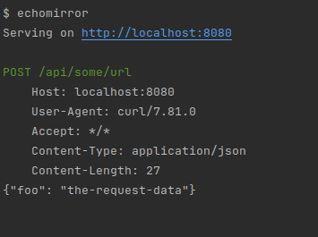

# echomirror
`echomirror` is a zero-configuration utility that logs all HTTP requests it receives.



## Installation
Using [pipx](https://github.com/pypa/pipx):
```bash
pipx install git+https://github.com/SpenceSellers/echomirror.git
```

After this the `echomirror` command should be available.
## Usage

```
Usage: echomirror [OPTIONS]

Options:
  -p, --port INTEGER           The port that echomirror will listen to
                               [default: 8080]
  -s, --status-code INTEGER    The HTTP status code we will return  [default:
                               200]
  --text TEXT                  Respond to requests with this text using the
                               text/plain content-type
  --json TEXT                  Respond to requests with this JSON using the
                               application/json content-type
  --expose / --localhost-only  Whether to expose this port to the outside
                               network (i.e., host on 0.0.0.0), or only allow
                               localhost connections.  [default: localhost-
                               only]
  --help                       Show this message and exit.
```

